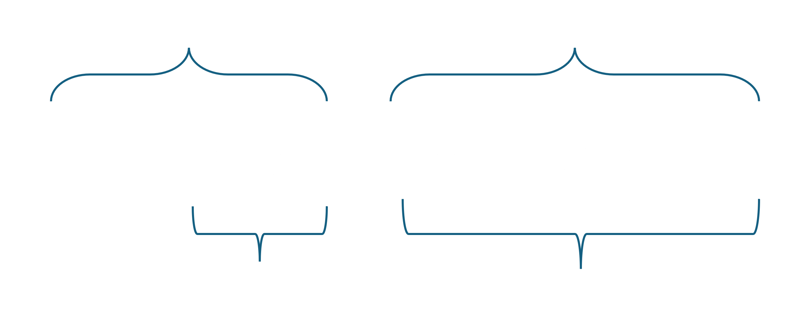

# Array in java

- Java array is different from c, cpp array. 
- In java, an array is an object and since objects are created in heap memory, array will also store in heap memory.
- There is no concept of pointers in java, thus there is no way to find the address of an array.
- Data is not stored sequentially in an array in java internally like if the address of the first index is 1000, then it is not necessary that the address of the next index will be 1004 of an int array.

### Creation of array

Array can be created in two ways in java

1.Assign value at the time of declaration like this
```java
int[] array = {10,20,30};
```

2.Set the size of the array and assign value later.
```java
int[] array = new int[5];
```
`new` is used to create a new object.

### Array object
In java, there is no name of an object, for example:
>int[] array1 = new array();

It might look like array1 is the name of the object of class `array` 
but in reality array1 is a reference variable and the actual object is in heap memory and array1 reference variable
is referring it.



### Reinitialization of the array.

as we know in Java, objects are created on the heap memory and do not have names. Instead, we use reference variables to
store the memory addresses of the objects and access their data and methods. Thus, we can assign memory address 
of another object in the same reference variable, but this will replace the previous object start pointing to another object.

**What happens to the previous object then?**

The previous object is no longer reachable by the `myCar` variable, so it becomes eligible for garbage collection. This means that the Java garbage collector will automatically reclaim the memory used by the object when it needs to free up some space. You cannot control when or how the garbage collector runs, so you cannot delete the object manually. The `finalize()` method is also automatically called by the garbage collector before the object is permanently removed from the memory.

```java
int[] array = new int[5]; // New object created and array is referencing it
array = new int[]{10, 20, 30, 40, 50}; // Again a new object is created, and now an array variable is referring to that new array old array is gone 
array = new int[8]; // Again a new variable is created and the preview object is gone

 /**
 It might look like we created an array and in the second line we are putting value in that array
 but in reality its new array and previous array is gone and now it a new array which contains value 10, 20, 30, 40, 50
 in third like it might look like we increased the size of the array to 8 but in reality again a new variable is created 
 and the old one is gone the value inside the array is 0,0,0,0,0,0,0,0
 **/
```
This code does the following:

- It creates an array of size 5 and assigns it to the variable array.
- It creates another array of size 5 with the values {10, 20, 30, 40, 50, 50} and assigns it to the same variable array, replacing the previous reference.
- It creates yet another array of size 8 and assigns it to the same variable array, replacing the previous reference again.
The result is that the variable array now refers to an array of size 8 with all elements initialized to 0. The other two
arrays are no longer accessible and are eligible for garbage collection. This is an example of dynamic memory allocation
in Java, where you can change the size and contents of an array at run time by creating new arrays and assigning them to
the same variable. However, this is not a very efficient or elegant way of doing so, as it involves creating and 
discarding multiple arrays. A better alternative would be to use an ArrayList, which can grow and shrink as needed 
without creating new arrays.