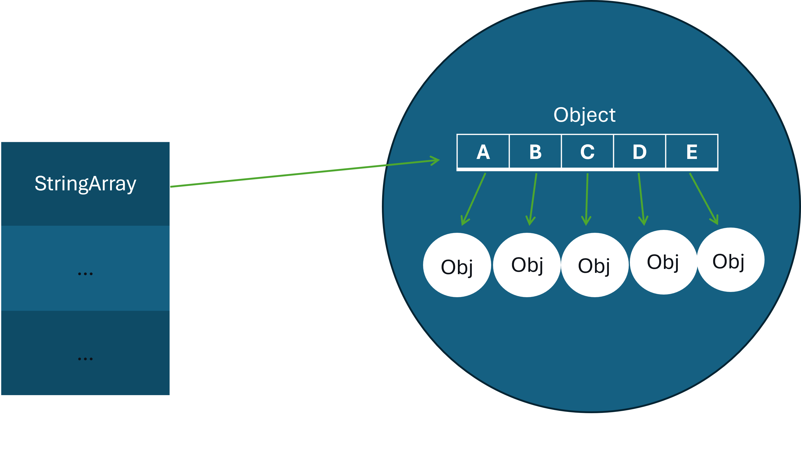

# Array of String

### Creation of a string array

Creation of a string array is the same as array. Instead of using int, we use String 

For example:
```java
 String[] StringArray = {"Anand", "is", "a", "human"};
```

or

```java
    String[] StringArray = new String[5]; 
```
### String array is actually a nested object 

As we know in java, String is an object,
and if we create an array of string, then it will be and array of an object since 
each string present in the array is an object.


*******************************************************

### Differences between String and StringBuffer and StringBuilder 

Certainly! Let's explore when to use **String**, **StringBuilder**, and **StringBuffer** in Java:

1. **String**:
    - **Use Case**:
        - When you need an **immutable** sequence of characters.
        - For storing constant or unchanging text.
    - **Advantages**:
        - Memory-efficient due to string pooling (reusing existing strings).
        - Thread-safe (since it's immutable).
    - **Disadvantages**:
        - Inefficient for frequent modifications (creates new objects).
    - **Examples**:
        - Storing constants, literals, or fixed messages.

2. **StringBuilder**:
    - **Use Case**:
        - When you need a **mutable** sequence of characters (frequent modifications).
        - In single-threaded scenarios.
    - **Advantages**:
        - Efficient for concatenation and modifications.
        - Faster than **StringBuffer** (no synchronization overhead).
    - **Examples**:
        - Building dynamic strings during program execution.

3. **StringBuffer**:
    - **Use Case**:
        - When you need a **thread-safe** (synchronized) mutable sequence of characters.
        - In multi-threaded environments.
    - **Advantages**:
        - Thread-safe (suitable for concurrent access).
        - Allows dynamic modifications.
    - **Examples**:
        - Shared data structures in multi-threaded applications.

Remember these guidelines:
- If you don't need mutability, use **String**.
- For efficiency in single-threaded programs, choose **StringBuilder**.
- For thread safety, opt for **StringBuffer**.

