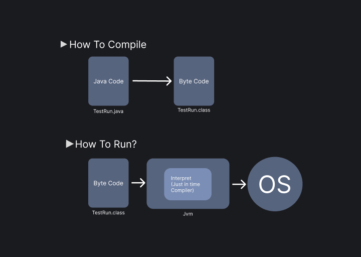

# Introduction to java

- Java is a case-sensitive programming language
- It is necessary to create a class with the same name as the name of that file in which that class is
- Java is nearly an object-oriented programming language
- In java, it is not possible to make function outside of class since all java files contain a class with the same name as java file
- There are four access specifiers public, private, protected, default
- In java dot(.) is used to access the static member like member function or member variable of the class.
- In java, all objects are created in the heap memory.
- In java, al the variables are declared at compiled time but memory is allocated at run time. Thus, java supports dynamic memory allocation.
- 
### Understand Hello world program

```java
public class TestRun { 
    public static void main(String[] args){
        System.out.println("Hello world");
    }
}
```
- In the first line, it is not necessary to use public if not used, then the default access specifier will be added.
- In the first line, We cannot make the first-class private or protected it can only be public or default.
- Just like in cpp when we create a static member function, then it no more belongs to an object but can be called without 
creating an object that is why we used static before the main function so that it can be accessed by the operating system without creating an object
- We can pass value in the main function when we are running it with command line, and that is why we used String[] args to get value in the main function
- In line 3 System is a class Out is a static reference variable, and it is referring to an object of a class, This object name is printStream and there is a function inside that printStream whose name is println

### Compilation
- In java source code is converted into byte code, this byte code can only be understood by jvm
- Byte code uses .class extension and if there are five class in source code, then five different .class files will be created
### Interpretation
- Interpretation is done by jvm java virtual machine which contains a just in time compiler **(Interpreter)**
- Jvm reads byte code **Line by line**, It takes one line then convert it in machine-understandable code then while the machine is running that code it interprets more lines and saves them for the execution



### Execution
- javac is a java compiler after which we write the name of the file and its extension
- Like these: javac TestRun.java
- Then after compilation a file with byte code will be generated to run it we will run an exe file name java
- Like This: java TestRun
- Notice something, We didn't write an extension of the file TestRun
- Hit enter and it will give output

```dtd
c:\java\jdk1\bin> javac TestRun.java 
c:\java\jdk1\bin> java TestRun 
```

### JDK, JRE, JIT and JVM

- **Java Virtual Machine (JVM)** JVM acts as a run-time engine to run Java applications. JVM is the one that actually calls the `main method` present in a Java code. JVM is a part of JRE(Java Runtime Environment).
- **JRE (Java runtime environment)**
  JRE (Java Runtime Environment) is an installation package that provides an environment to only run(not develop) the
  java program(or application) onto your machine. JRE is only used by those who only want to run Java programs that are
  end-users of your system.

- **Java Runtime Environment (JRE)** is an implementation of the JVM.

- **JDK (Java development Kid):**
    The JDK is a cross-platform software development environment that provides essential tools
    and libraries for creating Java-based applications and applets.

- **Just In Time compiler (JIT)** is runs after the program has started executing, on the fly. It has access to runtime information and makes optimizations of the code for better performance.

### Default Value in a variable

In Java, when a variable is declared but not initialized, it is assigned a default value based on its data type 1. The default values for the primitive data types in Java are as follows:

- byte: 0
- short: 0
- int: 0
- long: 0L
- float: 0.0f
- double: 0.0d
- char: ‘\u0000’
- boolean: false
- String: null

